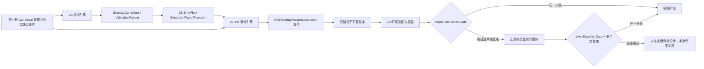

# 第二批确定性策略与事件回测设计

日期：2026-07-13
修订日期：2026-07-14
状态：2A 条件批准；2B–2D 未授权
基线：fork `main@bdb17cdff69cd2060a67e7ca314dda972eb7f83a`
设计分支：`design/second-batch-strategy-backtest`

## 1. 目标

第二批把第一批已验证的 Binance USDⓈ-M BTCUSDT/ETHUSDT Canonical 数据，转换为可复现的确定性市场 Candidate、执行计划、1 分钟事件路径、逐仓账户账本和研究报告。

本批设计继续遵守：

- Python 确定性规则是唯一交易决策源。
- LLM 永久不进入交易链路；本批不接 LLM Shadow Worker。
- 不接 GUI。
- 不接受 API Key、secret、signature 或账户参数。
- 不提供 `create_order`、交易端点、真实下单或自动实盘。
- 第一版只研究 Binance USDⓈ-M BTCUSDT、ETHUSDT 永续，4H 主周期、1D 趋势过滤、1m 执行回放。
- 固定逐仓、单向持仓、1 倍杠杆；2 倍必须作为后续独立实验，不能混入 V1 基准。
- 单笔初始风险上限 0.5%，组合冻结开放风险上限 1%，1m close equity 回撤达到或超过 10% 后进入 `1M_CLOSE_EQUITY_HALT_TRIGGERED → HALTED` 终态流程。

通过第二批验收只说明研究实现符合冻结规范，不代表策略能够盈利，也不授权前向模拟或实盘。

## 2. 不实现范围

第二批设计和未来实现均不包含：

- GUI、图表、按钮、桌面进程或 Web 服务。
- 任何 LLM、Prompt、模型路由、第三方中转站调用或 Shadow Worker。
- Binance 鉴权、账户查询、订单查询、WebSocket 账户流或交易请求。
- 真实下单、自动交易、实盘风控或密钥管理。
- 逐笔成交、盘口深度、排队位置或冲击模型。
- 全仓、多资产抵押、对冲模式、加仓、摊平、分批止盈、追踪止损或移动保本。
- 声称精确复刻 Binance 强平；所有强平结果必须标为估算。
- 在设计评审通过前创建 `pa_agent/research_backtest` 或对应测试代码。

## 3. 架构方案比较

### 方案 A：单体回测器

一个 runner 同时计算指标、信号、仓位、撮合、账本和报告。优点是文件少；缺点是市场判断容易读取账户状态，事件优先级隐藏在条件分支中，难以证明确定性和路径隔离。本项目不采用。

### 方案 B：四阶段纯函数管线（推荐）

按 `2A 指标与 Candidate → 2B Plan/风险/成本 → 2C 事件引擎/账本 → 2D 研究验证` 拆分。阶段间只传递不可变、Canonical、版本化对象；市场结论不读取组合状态，风险层不能改写 Candidate。优点是每个阶段可独立验收，失败语义清楚，适合当前审计要求。

### 方案 C：通用插件式交易框架

先建立策略插件、交易所插件、撮合插件和账户插件，再实现 V1。扩展性最好，但会提前引入本项目暂不需要的抽象、配置和动态加载，扩大安全面。本项目暂不采用。

结论：采用方案 B。每个子批次必须单独评审；批准 2A 不自动批准 2B–2D。

## 4. 逻辑架构



依赖方向只能从右侧消费左侧输出：

1. `research_data` 不得导入第二批模块。
2. 指标和 Candidate 不得导入 execution、risk、events、ledger 或 reporting。
3. execution/risk 可以读取 Candidate，但不能重算或改写市场结论。
4. event engine 只能消费已冻结的 Plan、市场数据和版本模型。
5. reporting 只读不可变事件和账本，不能反向改变路径。

## 5. 计划目录结构（本轮不创建）

```text
pa_agent/
  research_backtest/
    __init__.py
    domain/
      enums.py
      candidates.py
      execution.py
      events.py
      failures.py
      canonical.py
    indicators/
      numeric.py
      ema.py
      atr.py
      donchian.py
      engine.py
    strategy/
      btc_eth_pa_v1.py
      candidate_factory.py
    execution/
      quantization.py
      costs.py
      planner.py
      portfolio_scaling.py
    margin/
      contract_archive.py
      maintenance.py
      liquidation_estimate.py
    engine/
      clock.py
      data_gate.py
      path_policy.py
      minute_engine.py
      terminal_state.py
    ledger/
      accounts.py
      entries.py
      reducer.py
    experiments/
      manifest.py
      splits.py
      runner.py
      reproducibility.py
    reporting/
      metrics.py
      benchmarks.py
      confidence.py
      report.py
tests/
  research_backtest/
    fixtures/
      indicator_golden_v1.json
      strategy_golden_v1.json
      minute_path_golden_v1.json
    unit/
    integration/
    property/
    acceptance/
docs/
  superpowers/specs/
  verification/
research_backtest_output/       # gitignored，运行时输出
```

不得复用 `pa_agent/indicators`、`pa_agent/ai`、`pa_agent/gui`、`pa_agent/orchestrator` 或 `pa_agent/records` 的业务实现。第二批使用隔离包，避免既有 GUI/AI 交易提示逻辑成为依赖。

## 6. 数据输入和身份

### 6.1 输入依赖

- Candidate：`decision_visible_input_hash@DECISION_VISIBLE_INPUT_V1`，只含该 decision time 可见、从冻结 pre-roll/当前 segment 到决策点的 1D/4H 数据、验证状态和指标版本。
- 执行和事件路径：`execution_data_content_hash@EXECUTION_DATA_CONTENT_V1`，含 trade 1m、mark 1m、真实 funding。
- Index：`audit_data_content_hash@AUDIT_DATA_CONTENT_V1`，仅审计，不进入交易计算。
- 合约规则：独立 `contract_rule_content_hash` 和覆盖回放时刻的规则版本。
- 维持保证金：独立 maintenance-margin archive/version，不属于 Candidate。

完整区间 `strategy_data_content_hash` 保留在实验 Manifest 和计算实验 ID，用于数据集审计；禁止进入 Candidate Canonical 对象和 `candidate_id`。`acquisition_manifest_hash` 和 `acquisition_run_id` 只用于溯源，禁止进入 Candidate、Plan、Fill、账本或计算实验 ID。

### 6.2 实验身份

```text
computational_experiment_id = SHA256(Canonical({
  content_dependency_hashes,
  sample_manifest_hash,
  strategy_version,
  indicator_version,
  execution_version,
  risk_version,
  fee_version,
  slippage_version,
  funding_version,
  contract_rule_policy_version,
  maintenance_margin_version,
  liquidation_estimate_version,
  path_policy_version,
  code_commit,
  dependency_lock_version
}))
```

Candidate scope 的实验 Manifest 可以声明完整 strategy-data 依赖用于审计，但 Candidate 身份只能声明 `decision_visible_input_hash`；完整回测 scope 必须显式声明 execution、contract rule、maintenance margin 和全部模型版本。

## 7. 端到端数据流

1. 加载第一批 manifest、Canonical records 和缺口事实，重新核对 content hash。
2. 根据实验 manifest 切出 pre-roll、训练、验证、锁定 OOS；只允许 pre-roll 跨样本边界读取历史，不允许交易或绩效越界。
3. 2A 对连续有效的已收盘 1D/4H 数据计算版本化指标；每个有效 4H 决策时刻生成 Candidate 或独立 ValidationFailure。
4. 2B 在版本化目标执行分钟读取当时可见的 1m open；先形成独立计划草案，再做 gap、contract、成本、仓位、资金和组合风险判断，分别输出 EntryExecutionPlan、ExitExecutionPlan 或 ExecutionRejection。
5. 2C 以 UTC 分钟升序消费 trade、mark、funding 和计划，分叉 baseline/conservative 两条独立路径，产生不可变事件和账本。
6. 缺口由事件引擎按当时是否有行情依赖、计划、持仓或资金费边界解释；第一批缺口事实本身不被改写。
7. 2D 从终态账本生成绩效、基准、walk-forward、成本压力、参数敏感性和置信区间报告。
8. 任一路径 `INVALID`、`HALTED`、`BANKRUPT` 或未满足硬门槛，只能按其独立状态轴报告，不能被人工豁免为通过。

## 8. 确定性边界

- 价格、数量、费用、保证金、风险预算和账本统一使用 `Decimal`。
- EMA/ATR 内部只允许锁定 Python/平台版本、固定运算顺序的标量 Python `float` 递推；禁止向量化、FMA 或代数重排。Donchian 使用原始 Decimal OHLC。
- float64 只在 Candidate 边界通过 `Decimal.from_float(x).adjusted()` 推导量化指数，并转换为 15 位有效数字、round-half-even 的 Decimal；禁止 float `log10`。
- 价格按 tick 定向量化；数量按 step 向下量化；不得用 float 进行交易边界比较。
- 同时到期的 BTC/ETH 计划先全部独立计算，再共同缩量；不得按输入顺序、字典顺序或 symbol 优先级分配资金。
- 所有领域对象 frozen/不可变；状态变化只允许产生新事件并由 reducer 得到新状态。
- Candidate、Entry/Exit Plan、Rejection、Fill、Event、Ledger 和 StateSnapshot 的时间只能来自市场/实验事件时钟；本地 wall clock 只能作为领域外展示元数据，不能进入对象、Canonical bytes 或确定性 ID。
- StrategyCandidate 不含 entry intent、execution anchor 或 execution delay。2B 从 Candidate decision time 与独立 execution config 计算目标时刻；0/1/2 分钟延迟变化不得改变 Candidate 或 ID。
- 同一实验重复运行时，Candidate、Rejection、Plan、Fill、账本和报告 Canonical bytes 必须完全一致。

## 9. 生命周期和职责分离

- `StrategyCandidate`：Canonical `market_view=LONG | SHORT | NO_SETUP`，只回答市场 setup；`NO_TRADE` 仅可作为旧展示层兼容文案，不进入 Canonical 或 ID。
- `ValidationFailure`：数据、pre-roll、指标或版本不足；不能伪装为无 setup。
- `EntryExecutionPlan`：基于目标分钟可见数据，冻结 entry/stop/TP/quantity、成本和规则版本。
- `ExitExecutionPlan`：独立冻结退出原因、触发/参考价、数量和执行版本，不与 Entry Plan 共用大量条件字段。
- `ExecutionRejection`：已有仓位、HALTED、gap、contract、最小数量、风险或资金拒绝；不能改写 Candidate。
- `FillEvent`：模拟成交事实；final fill 已含滑点，后续不得重复计入。
- `FundingSettlementEvent`：真实历史 funding 现金变化。
- `EstimatedLiquidationEvent`：版本化估算，不声称为交易所实际强平。
- `LedgerEntry`：由事件归约产生的不可变现金、保证金、储备、PnL 和权益变化。

完整字段见 `2026-07-13-second-batch-lifecycle-event-spec.md`。

## 10. 子批次边界

### 2A：指标与 Candidate 纯函数

本次 2A 授权只覆盖：EMA/ATR/Donchian、冻结 pre-roll/segment reset、float64→Decimal、Golden Fixture、StrategyCandidate/ValidationFailure Schema、确定性 LONG/SHORT/NO_SETUP 规则、Canonical ID 和证明边界的静态守卫。禁止 EntryExecutionPlan、ExitExecutionPlan、ExecutionRejection、费用、滑点、contract rule、仓位、事件、撮合、资金费、强平、账本和报告。

### 2B：Entry/Exit ExecutionPlan、风险与仓位纯函数

只允许量化、成本、unit risk、逐仓现金需求、contract policy、计划/拒绝和同时等比例缩量纯函数。禁止分钟撮合、资金费结算、强平事件、账本和绩效。

### 2C：事件引擎、双路径与账本

实现 1m 顺序、执行/退出、资金费、保证金、估算强平、baseline/conservative、`PATH_AMBIGUOUS`、`INVALID`、`HALTED` 和不可变账本。禁止参数搜索自动选择最佳策略。

### 2D：研究验证与报告

实现冻结样本治理、基准、walk-forward、成本压力、参数敏感性、置信区间和前向模拟门槛。不得接 GUI、LLM、API Key 或交易接口。

## 11. 设计验收条件

进入任何实现前，评审必须明确接受：

1. 指标数值与 Golden Fixture。
2. Candidate 的唯一 Canonical `NO_SETUP` 语义及 display-only `NO_TRADE` 映射。
3. EntryExecutionPlan/ExitExecutionPlan 分离的生命周期 Schema、事件时钟和 Canonical ID 输入。
4. 1m 事件优先级及所有同分钟组合。
5. baseline/conservative 分叉条件。
6. 费用、滑点、资金费、unit risk、现金和保证金公式。
7. VERIFIED/APPROXIMATED contract rule 政策。
8. 估算强平公式和有效期。
9. `1M_CLOSE_EQUITY_HALT` 触发采样点、盘中回撤审计和终态报告语义。
10. 样本、置信区间、双基准、Paper Simulation Gate 与 Live Eligibility Gate。

本次只授权 2A；完成 2A PR 后必须停止。2B–2D 仍需分别独立批准。
